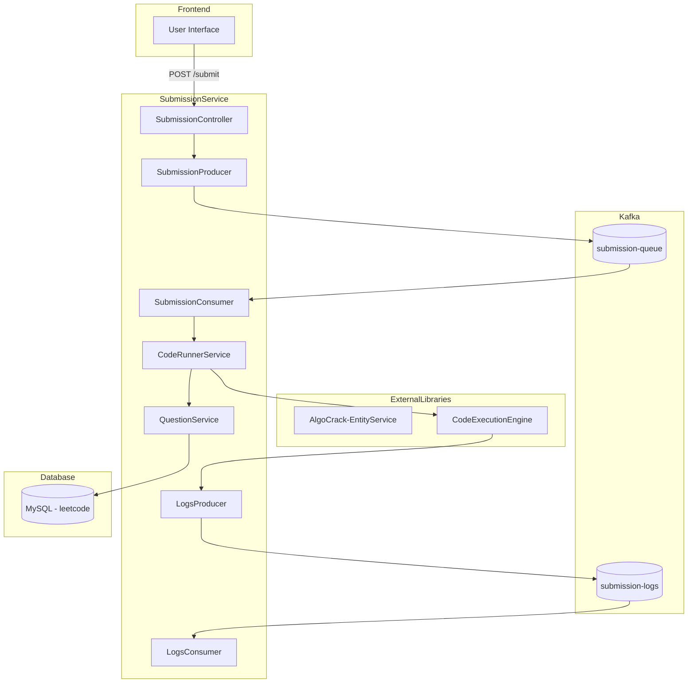
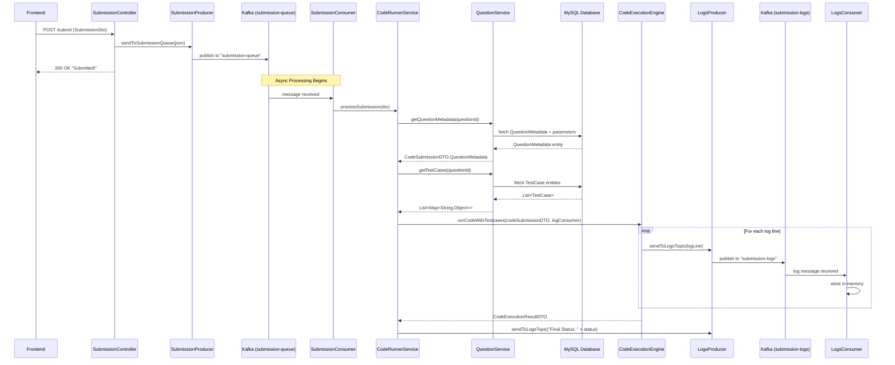

# AlgoCrack Submission Service - Complete Context

## Overview

**AlgoCrack-SubmissionService** is a Spring Boot microservice that handles code submissions for a LeetCode-like platform. It receives code submissions from the frontend, processes them asynchronously using Kafka, and executes them against test cases using a custom Code Execution Engine.

---

## Project Architecture



---

## Technology Stack

| Category | Technology | Version |
|----------|------------|---------|
| Framework | Spring Boot | 3.5.4 |
| Language | Java | 24 |
| Build Tool | Gradle | - |
| Database | MySQL | - |
| ORM | Spring Data JPA | - |
| Message Broker | Apache Kafka | - |
| Real-time Comm | Spring WebSocket | - |
| Annotations | Lombok | - |

---

## Dependencies

### Core Dependencies

```groovy
dependencies {
    implementation 'org.springframework.boot:spring-boot-starter-data-jpa'
    implementation 'org.springframework.boot:spring-boot-starter-web'
    implementation 'org.springframework.boot:spring-boot-starter-websocket'
    implementation 'org.springframework.kafka:spring-kafka'
    compileOnly 'org.projectlombok:lombok'
    runtimeOnly 'com.mysql:mysql-connector-j'
}
```

### Custom Libraries

| Library | Version | Purpose |
|---------|---------|---------|
| `AlgoCrack-EntityService` | 0.0.8-SNAPSHOT | Shared JPA entities (Question, QuestionMetadata, TestCase) |
| `CodeExecutionEngine` | 0.1.1-SNAPSHOT | Code compilation and execution with test case validation |

---

## Package Structure

```
src/main/java/com/hrishabh/algocracksubmissionservice/
├── AlgoCrackSubmissionServiceApplication.java   # Main application entry
├── config/
│   ├── AppConfig.java                           # Bean configurations
│   └── KafkaConfiguration.java                  # Kafka topics & templates
├── consumer/
│   ├── LogsConsumer.java                        # Listens to execution logs
│   └── SubmissionConsumer.java                  # Processes queued submissions
├── controllers/
│   └── SubmissionController.java                # REST API endpoint
├── dto/
│   └── SubmissionDto.java                       # Data transfer object
├── producer/
│   ├── LogsProducer.java                        # Publishes execution logs
│   └── SubmissionProducer.java                  # Queues submissions
├── repository/
│   ├── QuestionMetadataRepository.java          # Metadata queries
│   └── TestcaseRepository.java                  # Test case queries
└── service/
    ├── CodeRunnerService.java                   # Orchestrates execution
    └── QuestionService.java                     # Fetches question data
```

---

## Request/Response Flow

### Complete Submission Workflow



---

## DTO Structures

### SubmissionDto

**File:** `dto/SubmissionDto.java`

The primary DTO received from the frontend for code submissions.

```java
@Getter
@Setter
@Builder
@NoArgsConstructor
@AllArgsConstructor
public class SubmissionDto {
    private Long userId;           // User who submitted the code
    private Long submissionId;     // Unique submission identifier
    private Long questionId;       // Question being solved
    private String language;       // Programming language (e.g., "java", "python")
    private String code;           // User's solution code
}
```

**Example JSON:**
```json
{
    "userId": 12345,
    "submissionId": 67890,
    "questionId": 1,
    "language": "java",
    "code": "public int[] twoSum(int[] nums, int target) { ... }"
}
```

---

### External DTOs (from CodeExecutionEngine)

#### CodeSubmissionDTO

Built by `CodeRunnerService` to send to the execution engine.

```java
CodeSubmissionDTO.builder()
    .submissionId(String.valueOf(submissionDto.getSubmissionId()))
    .language(submissionDto.getLanguage())
    .userSolutionCode(submissionDto.getCode())
    .questionMetadata(metadata)
    .testCases(testCases)
    .build();
```

#### CodeSubmissionDTO.QuestionMetadata

Built by `QuestionService` from database entity.

```java
CodeSubmissionDTO.QuestionMetadata.builder()
    .fullyQualifiedPackageName("com.algocrack.solution.q" + questionId)
    .functionName(metadata.getFunctionName())       // e.g., "twoSum"
    .returnType(metadata.getReturnType())           // e.g., "int[]"
    .parameters(List<ParamInfoDTO>)                 // e.g., [{"nums", "int[]"}, {"target", "int"}]
    .customDataStructureNames(Set<String>)          // e.g., ["ListNode", "TreeNode"]
    .build();
```

#### ParamInfoDTO

Represents function parameter information.

```java
new ParamInfoDTO(
    paramInfo.getName(),   // e.g., "nums"
    paramInfo.getType()    // e.g., "int[]"
)
```

#### CodeExecutionResultDTO

Returned by the execution engine after running code.

```java
result.getOverallStatus()      // e.g., "ACCEPTED", "WRONG_ANSWER", "TIME_LIMIT_EXCEEDED"
result.getCompilationOutput()  // Compiler output if compilation failed
```

---

## Data Models (from EntityService)

These entities are defined in the external `AlgoCrack-EntityService` library and scanned via `@EntityScan`.

### QuestionMetadata

| Field | Type | Description |
|-------|------|-------------|
| `id` | Long | Primary key |
| `question` | Question | Parent question entity (ManyToOne) |
| `functionName` | String | Name of the solution function |
| `returnType` | String | Return type of the function |
| `parameters` | List\<ParamInfo\> | Collection of parameter info |
| `customDataStructureNames` | Set\<String\> | Custom types like TreeNode, ListNode |

### TestCase

| Field | Type | Description |
|-------|------|-------------|
| `id` | Long | Primary key |
| `questionId` | Long | Foreign key to Question |
| `input` | String | JSON string of input parameters |
| `expectedOutput` | String | JSON string of expected result |
| `orderIndex` | Integer | Ordering of test cases |

**Test Case JSON Example:**
```json
{
    "input": {"nums": [2,7,11,15], "target": 9},
    "expectedOutput": [0, 1]
}
```

---

## Kafka Configuration

### Topics

| Topic Name | Partitions | TTL | Purpose |
|------------|------------|-----|---------|
| `submission-queue` | 1 | Default | Queue pending submissions for processing |
| `submission-logs` | 5 | 2 minutes | Real-time execution logs |

### Producer Configuration

```java
ProducerConfig.BOOTSTRAP_SERVERS_CONFIG = "localhost:9092"
ProducerConfig.KEY_SERIALIZER_CLASS_CONFIG = StringSerializer.class
ProducerConfig.VALUE_SERIALIZER_CLASS_CONFIG = StringSerializer.class
```

### Consumer Configuration

```java
ConsumerConfig.BOOTSTRAP_SERVERS_CONFIG = "localhost:9092"
ConsumerConfig.GROUP_ID_CONFIG = "submission-service-group"
ConsumerConfig.KEY_DESERIALIZER_CLASS_CONFIG = StringDeserializer.class
ConsumerConfig.VALUE_DESERIALIZER_CLASS_CONFIG = StringDeserializer.class
```

### Consumer Groups

| Group ID | Consumer Class | Topic |
|----------|----------------|-------|
| `submission-service-group` | SubmissionConsumer | submission-queue |
| `log-reader-group` | LogsConsumer | submission-logs |

---

## Repository Layer

### QuestionMetadataRepository

```java
public interface QuestionMetadataRepository extends JpaRepository<QuestionMetadata, Long> {
    @Query("""
        SELECT qm 
        FROM QuestionMetadata qm 
        LEFT JOIN FETCH qm.parameters p 
        LEFT JOIN FETCH qm.customDataStructureNames c 
        WHERE qm.question.id = :questionId
    """)
    Optional<QuestionMetadata> findByQuestionIdWithAllCollections(@Param("questionId") Long questionId);
}
```

**Purpose:** Eagerly fetches metadata with all collections to avoid N+1 queries.

### TestcaseRepository

```java
public interface TestcaseRepository extends JpaRepository<TestCase, Long> {
    List<TestCase> findByQuestionIdOrderByOrderIndexAsc(long questionId);
}
```

**Purpose:** Fetches test cases in correct order for sequential validation.

---

## Service Layer

### CodeRunnerService

**Responsibility:** Orchestrates the entire code execution pipeline.

**Workflow:**
1. Receive `SubmissionDto` from Kafka consumer
2. Fetch question metadata from database via `QuestionService`
3. Fetch test cases from database via `QuestionService`
4. Build `CodeSubmissionDTO` for the execution engine
5. Create a Kafka log consumer lambda for real-time logging
6. Call `CodeExecutionManager.runCodeWithTestcases()`
7. Log final execution result

```java
public void processSubmission(SubmissionDto submissionDto) {
    // 1. Fetch metadata
    Optional<CodeSubmissionDTO.QuestionMetadata> metadata = 
        questionService.getQuestionMetadata(submissionDto.getQuestionId());
    
    // 2. Fetch test cases
    var testCases = questionService.getTestCases(submissionDto.getQuestionId());
    
    // 3. Build DTO
    CodeSubmissionDTO codeSubmissionDTO = CodeSubmissionDTO.builder()
        .submissionId(String.valueOf(submissionDto.getSubmissionId()))
        .language(submissionDto.getLanguage())
        .userSolutionCode(submissionDto.getCode())
        .questionMetadata(metadata.orElse(null))
        .testCases(testCases)
        .build();
    
    // 4. Create log consumer
    Consumer<String> kafkaLogConsumer = logLine -> {
        logsProducer.sendToLogsTopic(logLine);
    };
    
    // 5. Execute
    CodeExecutionResultDTO result = codeExecutionManager.runCodeWithTestcases(
        codeSubmissionDTO,
        kafkaLogConsumer
    );
    
    // 6. Log result
    logsProducer.sendToLogsTopic("Final Status: " + result.getOverallStatus());
}
```

### QuestionService

**Responsibility:** Transforms database entities into execution engine DTOs.

**Key Methods:**

| Method | Return Type | Description |
|--------|-------------|-------------|
| `getQuestionMetadata(Long questionId)` | `Optional<CodeSubmissionDTO.QuestionMetadata>` | Fetches and transforms metadata |
| `getTestCases(Long questionId)` | `List<Map<String, Object>>` | Fetches and parses test case JSON |

---

## API Endpoints

### POST /submit

Submits code for asynchronous execution.

**Request:**
```http
POST /submit
Content-Type: application/json

{
    "userId": 12345,
    "submissionId": 67890,
    "questionId": 1,
    "language": "java",
    "code": "public int[] twoSum(int[] nums, int target) { return new int[]{0, 1}; }"
}
```

**Response:**
```http
HTTP/1.1 200 OK
Content-Type: text/plain

Submitted!
```

---

## Configuration

### application.properties

```properties
spring.application.name=AlgoCrack-SubmissionService
spring.datasource.username=root
spring.datasource.password=hrishabh@123
spring.datasource.url=jdbc:mysql://localhost:3306/leetcode
spring.jpa.show-sql=true
spring.jpa.hibernate.ddl-auto=validate
spring.flyway.baseline-on-migrate=true
```

### Spring Boot Configuration

| Setting | Value | Purpose |
|---------|-------|---------|
| `ddl-auto` | validate | Don't modify schema, only validate entities |
| `show-sql` | true | Log SQL queries for debugging |
| `flyway.baseline-on-migrate` | true | Migration management |

---

## Component Scan Configuration

```java
@SpringBootApplication
@EntityScan("com.hrishabh.algocrackentityservice.models")
@EnableJpaRepositories("com.hrishabh.algocracksubmissionservice.repository")
@ComponentScan(basePackages = {
    "com.hrishabh.algocracksubmissionservice",  // This service
    "com.hrishabh.codeexecutionengine"          // Code execution engine
})
public class AlgoCrackSubmissionServiceApplication { ... }
```

---

## External Service Integration

### CodeExecutionEngine

The `CodeExecutionManager` bean is auto-wired from the `com.hrishabh.codeexecutionengine` package.

**Interface:**
```java
CodeExecutionResultDTO runCodeWithTestcases(
    CodeSubmissionDTO codeSubmission,
    Consumer<String> logConsumer
)
```

**Log Consumer Pattern:**
The service passes a lambda that forwards each log line to Kafka:
```java
Consumer<String> kafkaLogConsumer = logLine -> {
    logsProducer.sendToLogsTopic(logLine);
};
```

This enables real-time streaming of execution logs to connected clients via WebSocket (not yet implemented in this service).

---

## Infrastructure Requirements

### Required Services

1. **MySQL** - Port 3306, database: `leetcode`
2. **Apache Kafka** - Port 9092
3. **Zookeeper** - Required for Kafka

### Startup Commands

**Redis (if needed for caching):**
```bash
sudo service redis-server start
```

**Kafka (Linux/WSL):**
```bash
# Terminal 1 - Zookeeper
bin/zookeeper-server-start.sh config/zookeeper.properties

# Terminal 2 - Kafka
bin/kafka-server-start.sh config/server.properties
```

**Port Forwarding (WSL):**
```bash
netsh interface portproxy add v4tov4 listenaddress=127.0.0.1 listenport=9092 connectaddress=<WSL_IP> connectport=9092
```

---

## Execution Result Statuses

Expected statuses from `CodeExecutionResultDTO.getOverallStatus()`:

| Status | Description |
|--------|-------------|
| `ACCEPTED` | All test cases passed |
| `WRONG_ANSWER` | Output didn't match expected |
| `COMPILATION_ERROR` | Code failed to compile |
| `RUNTIME_ERROR` | Exception during execution |
| `TIME_LIMIT_EXCEEDED` | Execution took too long |
| `MEMORY_LIMIT_EXCEEDED` | Memory usage exceeded limits |

---

## Error Handling

### JSON Parsing Errors

Test case parsing failures return a fallback map:
```java
catch (JsonProcessingException e) {
    return Map.of("input", Map.of(), "expectedOutput", "JSON_PARSE_ERROR");
}
```

### Missing Metadata

```java
if (metadata == null) {
    System.out.println("Question metadata not found for questionId: " + questionId);
    return Optional.empty();
}
```

