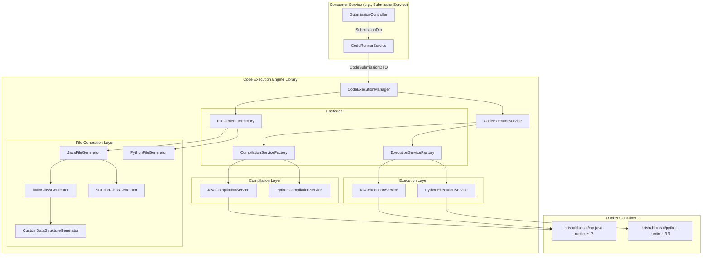
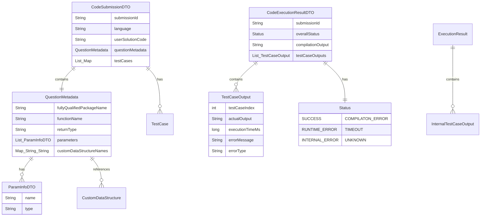
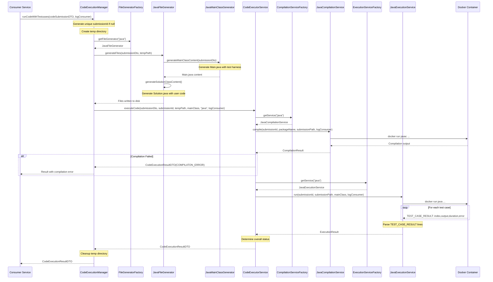
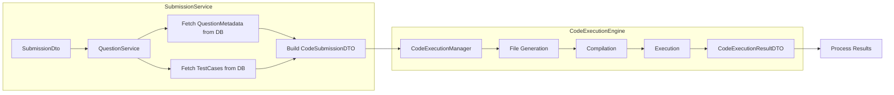

# AlgoCrack Code Execution Engine - Complete Context

## Overview

**CodeExecutionEngine** is a Spring Boot library that provides secure, isolated code execution for a LeetCode-like platform. It receives code submissions from the Submission Service, dynamically generates source files, compiles and executes them in Docker containers, and returns structured execution results with test case outputs.

This library is published to Maven Central (`xyz.hrishabhjoshi:CodeExecutionEngine`) and is designed to be autowired into consuming Spring Boot applications.

---

## Project Architecture



---

## Technology Stack

| Category | Technology | Version |
|----------|------------|---------|
| Framework | Spring Boot | 3.5.4 |
| Language | Java | 24 |
| Build Tool | Gradle | - |
| JSON Processing | Jackson Databind | - |
| Validation | Spring Boot Starter Validation | - |
| Annotations | Lombok | - |
| Containerization | Docker | - |
| Publishing | Maven Central | com.vanniktech.maven.publish |

---

## Dependencies

### Core Dependencies

```groovy
dependencies {
    implementation platform('org.springframework.boot:spring-boot-dependencies:3.5.4')
    implementation 'org.springframework.boot:spring-boot-starter-validation'
    implementation 'com.fasterxml.jackson.core:jackson-databind'
    compileOnly 'org.projectlombok:lombok'
    annotationProcessor 'org.projectlombok:lombok'
}
```

### Docker Images Required

| Image | Purpose |
|-------|---------|
| `hrishabhjoshi/my-java-runtime:17` | Java compilation and execution |
| `hrishabhjoshi/python-runtime:3.9` | Python execution |

---

## Package Structure

```
src/main/java/xyz/hrishabhjoshi/codeexecutionengine/
├── CodeExecutionEngineApplication.java          # Application entry point
├── CodeExecutionManager.java                    # Main orchestrator (entry point for consumers)
├── dto/
│   ├── CodeSubmissionDTO.java                   # Input DTO with nested QuestionMetadata
│   ├── CodeExecutionResultDTO.java              # Output DTO with test case results
│   ├── ParamInfoDTO.java                        # Parameter information
│   ├── Status.java                              # Execution status enum
│   ├── CompilationResult.java                   # Internal compilation result
│   └── ExecutionResult.java                     # Internal execution result
├── service/
│   ├── codeexecutionservice/
│   │   └── CodeExecutorService.java             # Orchestrates compile + execute
│   ├── compilation/
│   │   ├── CompilationService.java              # Interface
│   │   ├── JavaCompilationService.java          # Java Docker compiler
│   │   └── PythonCompilationService.java        # Python (no-op) compiler
│   ├── execution/
│   │   ├── ExecutionService.java                # Interface
│   │   ├── JavaExecutionService.java            # Java Docker executor
│   │   └── PythonExecutionService.java          # Python Docker executor
│   ├── factory/
│   │   ├── CompilationServiceFactory.java       # Factory for compilation services
│   │   ├── ExecutionServiceFactory.java         # Factory for execution services
│   │   └── FileGeneratorFactory.java            # Factory for file generators
│   └── filehandlingservice/
│       ├── FileGenerator.java                   # Interface
│       ├── java/
│       │   ├── JavaFileGenerator.java           # Generates Main.java + Solution.java
│       │   ├── JavaMainClassGenerator.java      # Generates Main.java with test harness
│       │   ├── JavaSolutionClassGenerator.java  # Generates Solution.java with user code
│       │   ├── CustomDataStructureGenerator.java# Generates ListNode/TreeNode/Node helpers
│       │   ├── InputVariableGenerator.java      # Generates input variable declarations
│       │   ├── ValueDeclarationGenerator.java   # Generates value initialization code
│       │   └── JavaCodeHelper.java              # Type detection utilities
│       └── python/
│           ├── PythonFileGenerator.java         # Generates main.py + solution.py
│           ├── PythonMainContentGenerator.java  # Generates main.py content
│           ├── PythonSolutionContentGenerator.java # Generates solution.py content
│           ├── PythonCustomDSGenerator.java     # Custom DS helpers for Python
│           └── PythonInputContentGenerator.java # Input handling for Python
```

---

## Data Models (DTOs)

### CodeSubmissionDTO

**File:** `dto/CodeSubmissionDTO.java`

The primary input DTO received from consuming services. Contains user code, metadata, and test cases.

```java
package xyz.hrishabhjoshi.codeexecutionengine.dto;

import lombok.*;
import java.util.List;
import java.util.Map;

@Getter
@Setter
@Builder
@NoArgsConstructor
@AllArgsConstructor
public class CodeSubmissionDTO {

    private String submissionId;
    private String language;
    private String userSolutionCode;
    private QuestionMetadata questionMetadata;
    private List<Map<String, Object>> testCases;

    @Getter
    @Setter
    @Builder
    @NoArgsConstructor
    @AllArgsConstructor
    public static class QuestionMetadata {

        private String fullyQualifiedPackageName;
        private String functionName;
        private String returnType;

        // List of parameter info (name + type)
        private List<ParamInfoDTO> parameters;

        // Map of custom data structure names (e.g., {"Node": "Node", "ListNode": "ListNode"})
        private Map<String, String> customDataStructureNames;
    }
}
```

**Field Descriptions:**

| Field | Type | Description |
|-------|------|-------------|
| `submissionId` | String | Unique identifier for the submission (auto-generated if null) |
| `language` | String | Programming language ("java" or "python") |
| `userSolutionCode` | String | User's complete solution class code |
| `questionMetadata` | QuestionMetadata | Metadata about the problem function |
| `testCases` | List<Map<String, Object>> | List of test cases with "input" and optionally "expectedOutput" |

**QuestionMetadata Fields:**

| Field | Type | Description |
|-------|------|-------------|
| `fullyQualifiedPackageName` | String | Package for generated code (e.g., "com.algocrack.solution.q1") |
| `functionName` | String | Name of the solution function to call (e.g., "twoSum") |
| `returnType` | String | Return type of the function (e.g., "int[]", "ListNode") |
| `parameters` | List<ParamInfoDTO> | Function parameters with names and types |
| `customDataStructureNames` | Map<String, String> | Custom types to generate (e.g., {"ListNode": "ListNode"}) |

**Example JSON:**

```json
{
    "submissionId": "sub-12345",
    "language": "java",
    "userSolutionCode": "class Solution { public int[] twoSum(int[] nums, int target) { return new int[]{0,1}; } }",
    "questionMetadata": {
        "fullyQualifiedPackageName": "com.algocrack.solution.q1",
        "functionName": "twoSum",
        "returnType": "int[]",
        "parameters": [
            {"name": "nums", "type": "int[]"},
            {"name": "target", "type": "int"}
        ],
        "customDataStructureNames": null
    },
    "testCases": [
        {
            "input": {"nums": [2,7,11,15], "target": 9}
        },
        {
            "input": {"nums": [3,2,4], "target": 6}
        }
    ]
}
```

---

### ParamInfoDTO

**File:** `dto/ParamInfoDTO.java`

Represents a single function parameter with its name and type.

```java
package xyz.hrishabhjoshi.codeexecutionengine.dto;

import lombok.AllArgsConstructor;
import lombok.Getter;
import lombok.NoArgsConstructor;
import lombok.Setter;

@Getter
@Setter
@NoArgsConstructor
@AllArgsConstructor
public class ParamInfoDTO {
    private String name;
    private String type;
}
```

**Field Descriptions:**

| Field | Type | Description |
|-------|------|-------------|
| `name` | String | Parameter variable name (e.g., "nums", "target") |
| `type` | String | Parameter type (e.g., "int[]", "ListNode", "int") |

**Example:**

```json
{"name": "head", "type": "ListNode"}
```

---

### CodeExecutionResultDTO

**File:** `dto/CodeExecutionResultDTO.java`

The output DTO returned after code execution. Contains overall status and per-test-case results.

```java
package xyz.hrishabhjoshi.codeexecutionengine.dto;

import lombok.*;
import java.util.List;

@Getter
@Setter
@Builder
@NoArgsConstructor
@AllArgsConstructor
public class CodeExecutionResultDTO {
    private String submissionId;
    private Status overallStatus;
    private String compilationOutput;
    private List<TestCaseOutput> testCaseOutputs;

    @Getter
    @Setter
    @Builder
    @NoArgsConstructor
    @AllArgsConstructor
    public static class TestCaseOutput {
        private int testCaseIndex;
        private String actualOutput;
        private long executionTimeMs;
        private String errorMessage;
        private String errorType;
    }
}
```

**Field Descriptions:**

| Field | Type | Description |
|-------|------|-------------|
| `submissionId` | String | The submission identifier |
| `overallStatus` | Status | Overall execution status enum |
| `compilationOutput` | String | Compilation stdout/stderr + execution logs |
| `testCaseOutputs` | List<TestCaseOutput> | Per-test-case execution results |

**TestCaseOutput Fields:**

| Field | Type | Description |
|-------|------|-------------|
| `testCaseIndex` | int | 0-based index of the test case |
| `actualOutput` | String | JSON-serialized output from user's code |
| `executionTimeMs` | long | Execution time in milliseconds |
| `errorMessage` | String | Error message if exception occurred (null otherwise) |
| `errorType` | String | Exception class name (e.g., "ArithmeticException") |

---

### Status

**File:** `dto/Status.java`

Enum representing the overall execution status.

```java
package xyz.hrishabhjoshi.codeexecutionengine.dto;

public enum Status {
    SUCCESS,
    COMPILATON_ERROR,
    RUNTIME_ERROR,
    TIMEOUT,
    INTERNAL_ERROR,
    UNKNOWN,
}
```

**Status Values:**

| Status | Description |
|--------|-------------|
| `SUCCESS` | All test cases executed without errors |
| `COMPILATON_ERROR` | Code failed to compile |
| `RUNTIME_ERROR` | Exception thrown during execution (non-zero exit code) |
| `TIMEOUT` | Execution exceeded 10-second limit |
| `INTERNAL_ERROR` | Engine error (file I/O, Docker communication, etc.) |
| `UNKNOWN` | Undetermined status |

---

### CompilationResult

**File:** `dto/CompilationResult.java`

Internal DTO for compilation phase results.

```java
package xyz.hrishabhjoshi.codeexecutionengine.dto;

public class CompilationResult {
    private boolean success;
    private String output;

    public CompilationResult(boolean success, String output) {
        this.success = success;
        this.output = output;
    }

    public boolean isSuccess() {
        return success;
    }

    public String getOutput() {
        return output;
    }
}
```

| Field | Type | Description |
|-------|------|-------------|
| `success` | boolean | Whether compilation succeeded |
| `output` | String | Compiler stdout/stderr |

---

### ExecutionResult

**File:** `dto/ExecutionResult.java`

Internal DTO for execution phase results (before conversion to public DTO).

```java
package xyz.hrishabhjoshi.codeexecutionengine.dto;

import lombok.*;
import java.util.List;

@Getter
@Setter
@Builder
@NoArgsConstructor
@AllArgsConstructor
public class ExecutionResult {
    private String rawOutput;
    private List<ExecutionResult.TestCaseOutput> testCaseOutputs;
    private boolean timedOut;
    private int exitCode;

    @Getter
    @Setter
    @Builder
    @NoArgsConstructor
    @AllArgsConstructor
    public static class TestCaseOutput {
        private int testCaseIndex;
        private String actualOutput;
        private long executionTimeMs;
        private String errorMessage;
        private String errorType;
    }
}
```

| Field | Type | Description |
|-------|------|-------------|
| `rawOutput` | String | Full stdout/stderr from Docker process |
| `testCaseOutputs` | List<TestCaseOutput> | Parsed test case results |
| `timedOut` | boolean | Whether execution timed out |
| `exitCode` | int | Process exit code (-999 for timeout) |

---

## Data Model Relationships



### Dependency Flow

| Source DTO | Depends On | Relationship |
|------------|------------|--------------|
| `CodeSubmissionDTO` | `QuestionMetadata` | One-to-One (embedded) |
| `QuestionMetadata` | `ParamInfoDTO` | One-to-Many |
| `QuestionMetadata` | `customDataStructureNames` | One-to-Many (Map) |
| `CodeExecutionResultDTO` | `TestCaseOutput` | One-to-Many |
| `CodeExecutionResultDTO` | `Status` | One-to-One |
| `ExecutionResult` | `TestCaseOutput` | One-to-Many (internal) |

---

## Complete Execution Workflow

### Sequence Diagram



---

## Service Layer Details

### CodeExecutionManager

**File:** `CodeExecutionManager.java`

The primary entry point for consuming services. Orchestrates the complete execution pipeline.

**Responsibilities:**
1. Generate submission ID if not provided
2. Create temporary directory for source files
3. Delegate file generation to appropriate `FileGenerator`
4. Delegate execution to `CodeExecutorService`
5. Handle exceptions and return appropriate error status
6. Clean up temporary files in finally block

**Public Interface:**

```java
@Service
public class CodeExecutionManager {

    public CodeExecutionResultDTO runCodeWithTestcases(
        CodeSubmissionDTO submissionDto, 
        Consumer<String> logConsumer
    );
}
```

**Log Consumer Pattern:**

The `logConsumer` is a callback that receives real-time log messages during execution:

```java
// Example usage in consuming service
codeExecutionManager.runCodeWithTestcases(
    submission,
    logLine -> kafkaProducer.send("logs-topic", logLine)
);
```

---

### CodeExecutorService

**File:** `service/codeexecutionservice/CodeExecutorService.java`

Orchestrates compilation and execution phases.

**Workflow:**
1. Validate submission directory exists
2. Get appropriate `CompilationService` from factory
3. Compile code (returns early if compilation fails)
4. Get appropriate `ExecutionService` from factory
5. Execute code and collect results
6. Determine overall status based on execution result
7. Convert internal `ExecutionResult` to public `CodeExecutionResultDTO`

---

### Factory Pattern Services

All factories use Spring's dependency injection to auto-discover implementations:

| Factory | Purpose | Implementations |
|---------|---------|-----------------|
| `FileGeneratorFactory` | Creates file generators | `JavaFileGenerator`, `PythonFileGenerator` |
| `CompilationServiceFactory` | Creates compilers | `JavaCompilationService`, `PythonCompilationService` |
| `ExecutionServiceFactory` | Creates executors | `JavaExecutionService`, `PythonExecutionService` |

---

## Docker Execution Details

### Java Compilation

```bash
docker run --rm \
    -v /path/to/submission:/app/src \
    -w /app \
    hrishabhjoshi/my-java-runtime:17 \
    javac \
    -d /app/src \
    -cp /app/libs/* \
    /app/src/{package}/Main.java \
    /app/src/{package}/Solution.java
```

### Java Execution

```bash
docker run --rm \
    -m 256m \
    --cpus 0.5 \
    -v /path/to/submission:/app/src \
    -w /app \
    hrishabhjoshi/my-java-runtime:17 \
    java \
    -cp /app/src:/app/libs/* \
    {fullyQualifiedPackage}.Main
```

### Python Execution

```bash
docker run --rm \
    -v /path/to/submission:/app \
    -w /app \
    hrishabhjoshi/python-runtime:3.9 \
    python3 \
    {package}/main.py
```

### Resource Limits

| Limit | Value | Purpose |
|-------|-------|---------|
| Memory | 256MB | Prevent memory exhaustion |
| CPU | 0.5 cores | Prevent CPU monopolization |
| Timeout | 10 seconds | Prevent infinite loops |

---

## Generated Code Structure

### Java File Generation

When a Java submission is processed, the engine generates:

1. **Main.java** - Test harness that:
   - Imports necessary packages
   - Instantiates `Solution` class
   - Iterates through test cases
   - Deserializes inputs from JSON
   - Calls the solution function
   - Captures execution time
   - Serializes output to JSON
   - Prints `TEST_CASE_RESULT: index,output,duration,error` format
   - Handles exceptions per test case

2. **Solution.java** - User's code with package declaration:
   ```java
   package com.algocrack.solution.q1;
   
   // User's code verbatim
   class Solution {
       public int[] twoSum(int[] nums, int target) {
           // ...
       }
   }
   ```

### Custom Data Structure Support

The engine can generate helper code for:

| Structure | Description |
|-----------|-------------|
| `ListNode` | Linked list node (val, next) |
| `TreeNode` | Binary tree node (val, left, right) |
| `Node` | Graph node (val, neighbors) |

Generated code includes:
- JSON deserialization helpers
- Array/List ↔ Structure conversion
- JSON serialization for output

---

## Test Case Result Protocol

The generated Main class prints results in a specific format that the execution service parses:

```
TEST_CASE_RESULT: <index>,<output>,<duration>,<error_info>
```

**Examples:**

| Scenario | Output |
|----------|--------|
| Success | `TEST_CASE_RESULT: 0,[0,1],15,` |
| Runtime Error | `TEST_CASE_RESULT: 1,,20,ArithmeticException: / by zero` |
| Null Output | `TEST_CASE_RESULT: 2,null,5,` |

---

## Error Handling

### Compilation Errors

When compilation fails:
1. `CompilationResult.success = false`
2. `CompilationResult.output` contains compiler stderr
3. Execution is skipped
4. `CodeExecutionResultDTO.overallStatus = COMPILATON_ERROR`

### Runtime Errors

When execution throws exception:
1. Exception is caught per test case in Main.java
2. Error info is embedded in `TEST_CASE_RESULT` line
3. `TestCaseOutput.errorType` and `errorMessage` are populated
4. `CodeExecutionResultDTO.overallStatus = RUNTIME_ERROR` (if exit code ≠ 0)

### Timeout

When execution exceeds 10 seconds:
1. Process is forcibly terminated
2. `ExecutionResult.timedOut = true`
3. `ExecutionResult.exitCode = -999`
4. `CodeExecutionResultDTO.overallStatus = TIMEOUT`

### Internal Errors

Any unexpected exception in the engine:
1. Exception is logged
2. `CodeExecutionResultDTO.overallStatus = INTERNAL_ERROR`
3. Error message included in `compilationOutput`

---

## Integration with Submission Service

### How Submission Service Consumes This Library

```java
// In SubmissionService's build.gradle
dependencies {
    implementation 'xyz.hrishabhjoshi:CodeExecutionEngine:1.0.2'
}

// In application class
@SpringBootApplication
@ComponentScan(basePackages = {
    "com.hrishabh.algocracksubmissionservice",
    "xyz.hrishabhjoshi.codeexecutionengine"  // Scan engine beans
})
public class SubmissionServiceApplication { }

// In service class
@Autowired
private CodeExecutionManager codeExecutionManager;

public void processSubmission(SubmissionDto dto) {
    CodeSubmissionDTO submission = buildCodeSubmissionDTO(dto);
    
    CodeExecutionResultDTO result = codeExecutionManager.runCodeWithTestcases(
        submission,
        logLine -> kafkaProducer.send("submission-logs", logLine)
    );
    
    // Process result...
}
```

### Data Flow from Submission Service



---

## Configuration

### Default Timeouts

| Operation | Timeout |
|-----------|---------|
| Execution | 10 seconds |
| Compilation | No explicit timeout (Docker container limits apply) |

### Docker Image Requirements

The Docker images must have:

**Java Runtime (`hrishabhjoshi/my-java-runtime:17`):**
- JDK 17+
- Jackson libraries in `/app/libs/`
- Working directory `/app`

**Python Runtime (`hrishabhjoshi/python-runtime:3.9`):**
- Python 3.9+
- Working directory `/app`

---

## Supported Data Types

### Java Types

| Category | Types |
|----------|-------|
| Primitives | `int`, `double`, `boolean`, `char` |
| Wrappers | `Integer`, `Double`, `Boolean`, `String` |
| Arrays | `int[]`, `String[]`, `double[]`, etc. |
| Collections | `List<Integer>`, `List<String>`, `List<List<Integer>>` |
| Custom DS | `ListNode`, `TreeNode`, `Node` |
| Custom Arrays | `ListNode[]`, `TreeNode[]` |
| Custom Lists | `List<ListNode>`, `List<TreeNode>` |

### Python Types

| Category | Types |
|----------|-------|
| Primitives | `int`, `float`, `bool`, `str` |
| Collections | `list`, `dict`, `set` |
| Custom DS | `ListNode`, `TreeNode`, `Node` |

---

## Maven Central Publication

This project is published as a library:

**Coordinates:**
```xml
<dependency>
    <groupId>xyz.hrishabhjoshi</groupId>
    <artifactId>CodeExecutionEngine</artifactId>
    <version>1.0.2</version>
</dependency>
```

**Gradle:**
```groovy
implementation 'xyz.hrishabhjoshi:CodeExecutionEngine:1.0.2'
```

---

## Summary

The Code Execution Engine is a self-contained library that:

1. **Receives** a `CodeSubmissionDTO` with user code, metadata, and test cases
2. **Generates** language-specific source files with test harnesses
3. **Compiles** code in isolated Docker containers
4. **Executes** code against test cases with resource limits
5. **Parses** structured output using the `TEST_CASE_RESULT` protocol
6. **Returns** a `CodeExecutionResultDTO` with overall status and per-test-case results
7. **Cleans up** temporary files automatically
