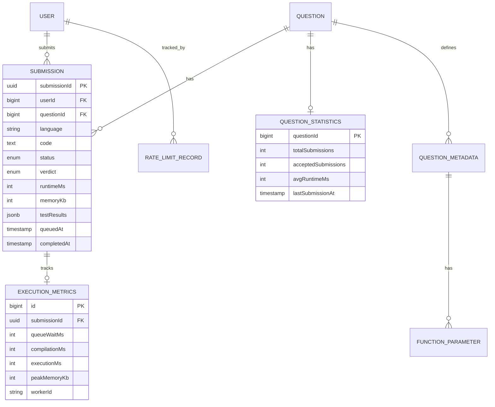

# AlgoCrack Entity Service - Detailed Improvements

## Current State Assessment

### What's Good ✅

1. **Clean Domain Modeling**
   - Proper JPA relationships
   - BaseModel for audit fields
   - Lombok for boilerplate reduction

2. **Separation of Concerns**
   - Single source of truth for entities
   - Published as library (JitPack)
   - No business logic in entities

3. **Proper Relationships**
   - Many-to-Many with join tables
   - Bidirectional navigation
   - Cascade operations configured

### What Needs Fixing 🔧

1. **Missing Critical Entities** (for production-grade system)
2. **Inefficient Relationships** (N+1 query problems)
3. **No Audit History** (can't track changes)
4. **Poor Indexing** (slow queries at scale)
5. **No Caching Strategy** (repeated DB hits)

---

## Required Schema Changes

### 1. Add Submissions Table (CRITICAL)

**Current Problem:**
```java
// Submissions are not persisted!
// Results are returned once and lost
// Cannot poll for status or view history
```

**New Entity:**

```java
package com.hrishabh.algocrackentityservice.models;

import jakarta.persistence.*;
import lombok.*;
import java.time.LocalDateTime;

@Entity
@Getter
@Setter
@NoArgsConstructor
@AllArgsConstructor
@Builder
@Table(
    indexes = {
        @Index(name = "idx_submission_id", columnList = "submissionId"),
        @Index(name = "idx_user_status", columnList = "userId,status"),
        @Index(name = "idx_question_status", columnList = "questionId,status"),
        @Index(name = "idx_status_queued", columnList = "status,queuedAt")
    }
)
public class Submission extends BaseModel {

    // Unique identifier for external reference
    @Column(unique = true, nullable = false, length = 36)
    private String submissionId; // UUID

    // Foreign Keys
    @Column(nullable = false)
    private Long userId;

    @Column(nullable = false)
    private Long questionId;

    // Code details
    @Column(nullable = false, length = 20)
    private String language; // java, python, cpp, javascript

    @Column(nullable = false, columnDefinition = "TEXT")
    private String code;

    // Status tracking
    @Enumerated(EnumType.STRING)
    @Column(nullable = false, length = 20)
    private SubmissionStatus status; // QUEUED, COMPILING, RUNNING, COMPLETED, FAILED

    @Enumerated(EnumType.STRING)
    @Column(length = 30)
    private SubmissionVerdict verdict; // ACCEPTED, WRONG_ANSWER, TLE, MLE, RE, CE

    // Performance metrics
    @Column
    private Integer runtimeMs;

    @Column
    private Integer memoryKb;

    // Test case results
    @Column(columnDefinition = "JSONB") // PostgreSQL JSONB for efficient querying
    private String testResults; // [{index: 0, passed: true, time: 15, memory: 1024}, ...]

    // Error information
    @Column(columnDefinition = "TEXT")
    private String errorMessage;

    @Column(columnDefinition = "TEXT")
    private String compilationOutput;

    // Timestamps
    @Column(nullable = false)
    private LocalDateTime queuedAt;

    @Column
    private LocalDateTime startedAt;

    @Column
    private LocalDateTime completedAt;

    // Client metadata
    @Column(length = 45)
    private String ipAddress; // IPv4: 15 chars, IPv6: 45 chars

    @Column(columnDefinition = "TEXT")
    private String userAgent;

    // Calculate processing time
    public Long getProcessingTimeMs() {
        if (queuedAt != null && completedAt != null) {
            return java.time.Duration.between(queuedAt, completedAt).toMillis();
        }
        return null;
    }

    // Calculate queue wait time
    public Long getQueueWaitTimeMs() {
        if (queuedAt != null && startedAt != null) {
            return java.time.Duration.between(queuedAt, startedAt).toMillis();
        }
        return null;
    }
}
```

**Supporting Enums:**

```java
package com.hrishabh.algocrackentityservice.models;

public enum SubmissionStatus {
    QUEUED,      // In queue waiting for worker
    COMPILING,   // Being compiled
    RUNNING,     // Executing against test cases
    COMPLETED,   // Finished (check verdict for result)
    FAILED,      // System error (not user code error)
    CANCELLED    // User cancelled or timeout
}

public enum SubmissionVerdict {
    ACCEPTED,              // All test cases passed
    WRONG_ANSWER,          // Output doesn't match
    TIME_LIMIT_EXCEEDED,   // Execution too slow
    MEMORY_LIMIT_EXCEEDED, // Used too much memory
    RUNTIME_ERROR,         // Exception/crash
    COMPILATION_ERROR,     // Code didn't compile
    INTERNAL_ERROR,        // Judge system error
    PARTIAL_CORRECT        // Some test cases passed (for contests)
}
```

**Migration SQL:**

```sql
-- V1__create_submissions_table.sql

CREATE TABLE submission (
    id BIGSERIAL PRIMARY KEY,
    submission_id VARCHAR(36) UNIQUE NOT NULL,
    user_id BIGINT NOT NULL,
    question_id BIGINT NOT NULL,
    language VARCHAR(20) NOT NULL,
    code TEXT NOT NULL,
    
    status VARCHAR(20) NOT NULL,
    verdict VARCHAR(30),
    
    runtime_ms INTEGER,
    memory_kb INTEGER,
    test_results JSONB,
    
    error_message TEXT,
    compilation_output TEXT,
    
    queued_at TIMESTAMP NOT NULL,
    started_at TIMESTAMP,
    completed_at TIMESTAMP,
    
    ip_address VARCHAR(45),
    user_agent TEXT,
    
    created_at TIMESTAMP NOT NULL DEFAULT NOW(),
    updated_at TIMESTAMP NOT NULL DEFAULT NOW()
);

-- Indexes for common queries
CREATE INDEX idx_submission_id ON submission(submission_id);
CREATE INDEX idx_user_status ON submission(user_id, status);
CREATE INDEX idx_question_status ON submission(question_id, status);
CREATE INDEX idx_status_queued ON submission(status, queued_at) WHERE status != 'COMPLETED';

-- Foreign keys (optional, can add later)
-- ALTER TABLE submission ADD CONSTRAINT fk_user FOREIGN KEY (user_id) REFERENCES "user"(id);
-- ALTER TABLE submission ADD CONSTRAINT fk_question FOREIGN KEY (question_id) REFERENCES question(id);
```

---

### 2. Add Execution Metrics Table (For Analytics)

```java
package com.hrishabh.algocrackentityservice.models;

import jakarta.persistence.*;
import lombok.*;

@Entity
@Getter
@Setter
@NoArgsConstructor
@AllArgsConstructor
@Builder
@Table(indexes = {
    @Index(name = "idx_submission_id", columnList = "submissionId")
})
public class ExecutionMetrics extends BaseModel {

    @Column(nullable = false, length = 36)
    private String submissionId;

    // Timing breakdown
    @Column
    private Integer queueWaitMs; // Time waiting in queue

    @Column
    private Integer compilationMs; // Compilation time

    @Column
    private Integer executionMs; // Total execution time

    @Column
    private Integer totalMs; // End-to-end time

    // Resource usage
    @Column
    private Integer peakMemoryKb;

    @Column
    private Integer cpuTimeMs;

    // System info
    @Column(length = 50)
    private String workerId; // Which worker processed this

    @Column(length = 100)
    private String executionNode; // Hostname/IP of execution node

    @Column
    private Boolean usedCache; // Whether result was cached

    // Test case breakdown
    @Column(columnDefinition = "JSONB")
    private String testCaseTimings; // [{index: 0, compile: 450, execute: 15}, ...]
}
```

---

### 3. Improve QuestionMetadata Entity

**Current Problems:**
```java
// 1. ElementCollection causes N+1 queries
@ElementCollection
private List<String> paramTypes = new ArrayList<>();

// 2. No proper relationship to parameters
// 3. customDataStructureNames as ElementCollection is inefficient
```

**Better Design:**

```java
package com.hrishabh.algocrackentityservice.models;

import jakarta.persistence.*;
import lombok.*;
import java.util.ArrayList;
import java.util.List;

@Entity
@Getter
@Setter
@NoArgsConstructor
@AllArgsConstructor
@Builder
@Table(indexes = {
    @Index(name = "idx_question_lang", columnList = "questionId,language")
})
public class QuestionMetadata extends BaseModel {

    @Column(nullable = false)
    private Long questionId; // Denormalized for easier querying

    @Column(nullable = false)
    private String functionName;

    @Column(nullable = false)
    private String returnType;

    @Enumerated(EnumType.STRING)
    @Column(nullable = false)
    private Language language;

    // REPLACE ElementCollection with proper entity
    @OneToMany(mappedBy = "metadata", cascade = CascadeType.ALL, orphanRemoval = true)
    @OrderColumn(name = "param_order") // Maintains parameter order
    private List<FunctionParameter> parameters = new ArrayList<>();

    @Column(columnDefinition = "TEXT")
    private String codeTemplate;

    @Column(columnDefinition = "TEXT")
    private String testCaseFormat;

    @Column
    private String executionStrategy; // function, main-based, class

    @Column
    private Boolean customInputEnabled;

    // Custom DS names as JSON instead of ElementCollection
    @Column(columnDefinition = "JSONB")
    private String customDataStructures; // ["ListNode", "TreeNode"]
}
```

**New FunctionParameter Entity:**

```java
package com.hrishabh.algocrackentityservice.models;

import jakarta.persistence.*;
import lombok.*;

@Entity
@Getter
@Setter
@NoArgsConstructor
@AllArgsConstructor
@Builder
public class FunctionParameter extends BaseModel {

    @ManyToOne(fetch = FetchType.LAZY)
    @JoinColumn(name = "metadata_id", nullable = false)
    private QuestionMetadata metadata;

    @Column(nullable = false)
    private String name; // e.g., "nums"

    @Column(nullable = false)
    private String type; // e.g., "int[]"

    @Column(nullable = false)
    private Integer paramOrder; // 0, 1, 2, ...

    // For complex types
    @Column
    private Boolean isCustomType; // true if ListNode, TreeNode, etc.

    @Column
    private String typeDefinition; // Class definition if custom
}
```

**Migration:**

```sql
CREATE TABLE function_parameter (
    id BIGSERIAL PRIMARY KEY,
    metadata_id BIGINT NOT NULL,
    name VARCHAR(50) NOT NULL,
    type VARCHAR(100) NOT NULL,
    param_order INTEGER NOT NULL,
    is_custom_type BOOLEAN DEFAULT FALSE,
    type_definition TEXT,
    created_at TIMESTAMP NOT NULL DEFAULT NOW(),
    updated_at TIMESTAMP NOT NULL DEFAULT NOW(),
    
    FOREIGN KEY (metadata_id) REFERENCES question_metadata(id) ON DELETE CASCADE
);

CREATE INDEX idx_metadata_params ON function_parameter(metadata_id, param_order);
```

---

### 4. Add Question Statistics Entity

```java
package com.hrishabh.algocrackentityservice.models;

import jakarta.persistence.*;
import lombok.*;

@Entity
@Getter
@Setter
@NoArgsConstructor
@AllArgsConstructor
@Builder
@Table(indexes = {
    @Index(name = "idx_question_stats", columnList = "questionId")
})
public class QuestionStatistics extends BaseModel {

    @Column(nullable = false, unique = true)
    private Long questionId;

    // Submission counts
    @Column(nullable = false)
    private Integer totalSubmissions = 0;

    @Column(nullable = false)
    private Integer acceptedSubmissions = 0;

    // Acceptance rate
    public Double getAcceptanceRate() {
        if (totalSubmissions == 0) return 0.0;
        return (acceptedSubmissions * 100.0) / totalSubmissions;
    }

    // Performance metrics
    @Column
    private Integer avgRuntimeMs;

    @Column
    private Integer avgMemoryKb;

    // Difficulty insights
    @Column
    private Integer avgAttempts; // Average attempts before solving

    // Last updated
    @Column
    private java.time.LocalDateTime lastSubmissionAt;

    // Version for optimistic locking
    @Version
    private Long version;
}
```

---

### 5. Add Rate Limiting Entity

```java
package com.hrishabh.algocrackentityservice.models;

import jakarta.persistence.*;
import lombok.*;
import java.time.LocalDateTime;

@Entity
@Getter
@Setter
@NoArgsConstructor
@AllArgsConstructor
@Builder
@Table(indexes = {
    @Index(name = "idx_user_window", columnList = "userId,windowStart")
})
public class RateLimitRecord extends BaseModel {

    @Column(nullable = false)
    private Long userId;

    @Column(nullable = false)
    private LocalDateTime windowStart; // Start of time window (e.g., top of the minute)

    @Column(nullable = false)
    private Integer requestCount = 0;

    @Column(length = 50)
    private String limitType; // SUBMISSION, API_CALL, etc.

    // TTL - auto-delete old records
    @Column
    private LocalDateTime expiresAt;
}
```

---

## Performance Optimizations

### 1. Add Database Indexes

**Current Problem:**
- No indexes on foreign keys
- No composite indexes for common queries
- Full table scans on every query

**Solution:**

```sql
-- Submission queries
CREATE INDEX idx_submission_user_date ON submission(user_id, queued_at DESC);
CREATE INDEX idx_submission_question_verdict ON submission(question_id, verdict);
CREATE INDEX idx_submission_status_queued ON submission(status, queued_at) 
    WHERE status IN ('QUEUED', 'COMPILING', 'RUNNING');

-- Question queries
CREATE INDEX idx_question_difficulty ON question(difficulty_level);
CREATE INDEX idx_question_company ON question(company) WHERE company IS NOT NULL;

-- Test case queries
CREATE INDEX idx_testcase_question_order ON test_case(question_id, order_index);

-- Tag queries (for many-to-many)
CREATE INDEX idx_question_tag_question ON question_tag(question_id);
CREATE INDEX idx_question_tag_tag ON question_tag(tag_id);
```

### 2. Add JPA Query Hints

```java
@Entity
@Table(name = "submission")
@org.hibernate.annotations.Cache(usage = CacheConcurrencyStrategy.READ_WRITE)
public class Submission extends BaseModel {
    // Enable second-level cache for frequently accessed data
}
```

### 3. Add Database Partitioning (Advanced)

For large-scale systems, partition submissions by date:

```sql
-- Partition submissions by month
CREATE TABLE submission_2024_01 PARTITION OF submission
    FOR VALUES FROM ('2024-01-01') TO ('2024-02-01');

CREATE TABLE submission_2024_02 PARTITION OF submission
    FOR VALUES FROM ('2024-02-01') TO ('2024-03-01');

-- Auto-create partitions with pg_partman
```

---

## Entity Relationship Updates

### Updated ER Diagram



---

## Caching Strategy

### 1. Add Cacheable Annotations

```java
@Entity
@Table(name = "question")
@Cacheable
@org.hibernate.annotations.Cache(
    usage = CacheConcurrencyStrategy.READ_WRITE,
    region = "questionCache"
)
public class Question extends BaseModel {
    // Questions rarely change, cache heavily
}

@Entity
@Table(name = "question_metadata")
@Cacheable
@org.hibernate.annotations.Cache(
    usage = CacheConcurrencyStrategy.READ_WRITE,
    region = "metadataCache"
)
public class QuestionMetadata extends BaseModel {
    // Metadata never changes, cache indefinitely
}
```

### 2. Configure Ehcache/Redis

**application.yml:**

```yaml
spring:
  jpa:
    properties:
      hibernate:
        cache:
          use_second_level_cache: true
          use_query_cache: true
          region:
            factory_class: org.hibernate.cache.jcache.JCacheRegionFactory
  cache:
    type: redis
    redis:
      time-to-live: 3600000 # 1 hour
      cache-null-values: false

# Cache configuration
cache:
  regions:
    questionCache:
      ttl: 86400 # 24 hours
    metadataCache:
      ttl: 604800 # 7 days
    submissionCache:
      ttl: 300 # 5 minutes (recent submissions)
```

---

## Repository Improvements

### 1. Add Custom Query Methods

```java
package com.hrishabh.algocrackentityservice.repository;

import org.springframework.data.jpa.repository.*;
import org.springframework.data.repository.query.Param;
import java.util.List;
import java.util.Optional;

public interface SubmissionRepository extends JpaRepository<Submission, Long> {

    // Find by submission ID
    Optional<Submission> findBySubmissionId(String submissionId);

    // User's recent submissions
    @Query("""
        SELECT s FROM Submission s 
        WHERE s.userId = :userId 
        ORDER BY s.queuedAt DESC
        """)
    List<Submission> findRecentByUserId(@Param("userId") Long userId, Pageable pageable);

    // Count pending submissions (for queue monitoring)
    @Query("""
        SELECT COUNT(s) FROM Submission s 
        WHERE s.status IN ('QUEUED', 'COMPILING', 'RUNNING')
        """)
    Long countPendingSubmissions();

    // Question acceptance rate
    @Query("""
        SELECT COUNT(s) FROM Submission s 
        WHERE s.questionId = :questionId 
        AND s.verdict = 'ACCEPTED'
        """)
    Long countAcceptedByQuestionId(@Param("questionId") Long questionId);

    // Average runtime for a question
    @Query("""
        SELECT AVG(s.runtimeMs) FROM Submission s 
        WHERE s.questionId = :questionId 
        AND s.verdict = 'ACCEPTED'
        """)
    Double getAverageRuntimeByQuestionId(@Param("questionId") Long questionId);

    // Leaderboard query
    @Query(value = """
        SELECT s.* FROM submission s
        INNER JOIN (
            SELECT user_id, MIN(runtime_ms) as best_time
            FROM submission
            WHERE question_id = :questionId AND verdict = 'ACCEPTED'
            GROUP BY user_id
        ) best ON s.user_id = best.user_id AND s.runtime_ms = best.best_time
        WHERE s.question_id = :questionId
        ORDER BY s.runtime_ms ASC
        LIMIT :limit
        """, nativeQuery = true)
    List<Submission> findLeaderboardByQuestionId(
        @Param("questionId") Long questionId,
        @Param("limit") int limit
    );
}
```

### 2. Add Projection Interfaces (For Performance)

```java
package com.hrishabh.algocrackentityservice.projections;

public interface SubmissionSummary {
    String getSubmissionId();
    SubmissionStatus getStatus();
    SubmissionVerdict getVerdict();
    Integer getRuntimeMs();
    LocalDateTime getQueuedAt();
}

// Usage in repository
public interface SubmissionRepository extends JpaRepository<Submission, Long> {
    
    List<SubmissionSummary> findByUserId(Long userId, Pageable pageable);
    // Returns only needed fields, not full entity
}
```

---

## Version & Publishing

### Update build.gradle

```groovy
group = 'com.github.hrishabh6'
version = 'v2.0.0' // Bump version

publishing {
    publications {
        mavenJava(MavenPublication) {
            from components.java
            
            pom {
                name = 'AlgoCrack Entity Service'
                description = 'Shared JPA entities for AlgoCrack platform'
                url = 'https://github.com/hrishabh6/AlgoCrack-EntityService'
                
                licenses {
                    license {
                        name = 'MIT License'
                        url = 'https://opensource.org/licenses/MIT'
                    }
                }
            }
        }
    }
}
```

---

## Migration Strategy

### Phase 1: Add New Entities (Week 1)

```
1. Create Submission entity
2. Create ExecutionMetrics entity
3. Create QuestionStatistics entity
4. Create FunctionParameter entity
5. Run Flyway migrations
6. Test locally
```

### Phase 2: Update Existing (Week 1)

```
1. Modify QuestionMetadata
2. Migrate data from ElementCollection to FunctionParameter
3. Add indexes
4. Update repositories
5. Test queries
```

### Phase 3: Performance (Week 2)

```
1. Add caching configuration
2. Add query hints
3. Load test with 10K records
4. Optimize slow queries
5. Add monitoring
```

### Phase 4: Publish (Week 2)

```
1. Bump version to v2.0.0
2. Tag release in GitHub
3. Trigger JitPack build
4. Update consuming services
5. Write migration guide
```

---

## Testing Checklist

### Unit Tests

```java
@DataJpaTest
class SubmissionRepositoryTest {
    
    @Autowired
    private SubmissionRepository submissionRepository;
    
    @Test
    void testFindBySubmissionId() {
        // Given
        Submission sub = Submission.builder()
            .submissionId(UUID.randomUUID().toString())
            .userId(1L)
            .questionId(1L)
            .language("java")
            .code("class Solution {}")
            .status(SubmissionStatus.QUEUED)
            .queuedAt(LocalDateTime.now())
            .build();
        submissionRepository.save(sub);
        
        // When
        Optional<Submission> found = submissionRepository
            .findBySubmissionId(sub.getSubmissionId());
        
        // Then
        assertTrue(found.isPresent());
        assertEquals(sub.getUserId(), found.get().getUserId());
    }
    
    @Test
    void testCountPendingSubmissions() {
        // Create test data
        // ...
        Long count = submissionRepository.countPendingSubmissions();
        assertEquals(3L, count);
    }
}
```

### Performance Tests

```java
@SpringBootTest
class SubmissionPerformanceTest {
    
    @Autowired
    private SubmissionRepository submissionRepository;
    
    @Test
    void testBulkInsert() {
        StopWatch watch = new StopWatch();
        watch.start();
        
        List<Submission> subs = new ArrayList<>();
        for (int i = 0; i < 10000; i++) {
            subs.add(createSubmission());
        }
        submissionRepository.saveAll(subs);
        
        watch.stop();
        System.out.println("Inserted 10K submissions in " + watch.getTotalTimeMillis() + "ms");
        assertTrue(watch.getTotalTimeMillis() < 5000); // Should be < 5 seconds
    }
}
```

---

## Documentation Updates

### README.md

```markdown
# AlgoCrack Entity Service v2.0

## What's New in v2.0

### New Entities
- **Submission**: Track code submissions with status, verdict, and metrics
- **ExecutionMetrics**: Detailed performance analytics
- **QuestionStatistics**: Question difficulty and acceptance rate
- **FunctionParameter**: Proper parameter modeling (replaces ElementCollection)

### Performance Improvements
- Added 12 database indexes for common queries
- Enabled second-level caching with Redis
- Optimized N+1 query problems
- Added projection interfaces for efficient queries

### Breaking Changes
- `QuestionMetadata.paramTypes` removed (use `parameters` list)
- `QuestionMetadata.paramNames` removed (use `parameters` list)
- `QuestionMetadata.customDataStructureNames` now JSON string

## Migration from v1.x

1. Run Flyway migrations:
```bash
./gradlew flywayMigrate
```

2. Update code:
```java
// Old
List<String> types = metadata.getParamTypes();

// New
List<FunctionParameter> params = metadata.getParameters();
String firstType = params.get(0).getType();
```

3. Update dependency version:
```gradle
implementation 'com.github.hrishabh6:AlgoCrack-EntityService:v2.0.0'
```
```

---

## Summary of Changes

| Change | Impact | Priority | Effort |
|--------|--------|----------|--------|
| Add Submission entity | **CRITICAL** - Enables async execution | 🔴 P0 | 1 day |
| Add ExecutionMetrics | Medium - Analytics | 🟡 P2 | 4 hours |
| Add QuestionStatistics | Low - Nice to have | 🟢 P3 | 4 hours |
| Fix QuestionMetadata | High - Performance | 🟠 P1 | 1 day |
| Add FunctionParameter | High - Proper modeling | 🟠 P1 | 1 day |
| Add indexes | High - Query performance | 🟠 P1 | 2 hours |
| Add caching | Medium - Performance | 🟡 P2 | 4 hours |
| Update repositories | High - Required for new queries | 🟠 P1 | 4 hours |

**Total Effort:** ~5-6 days

**Order of Implementation:**
1. Submission entity + migration (Day 1)
2. FunctionParameter refactor (Day 2)
3. Add indexes (Day 2)
4. ExecutionMetrics + QuestionStatistics (Day 3)
5. Repository updates (Day 4)
6. Caching configuration (Day 4)
7. Testing and documentation (Day 5)
8. Publish v2.0.0 (Day 5)