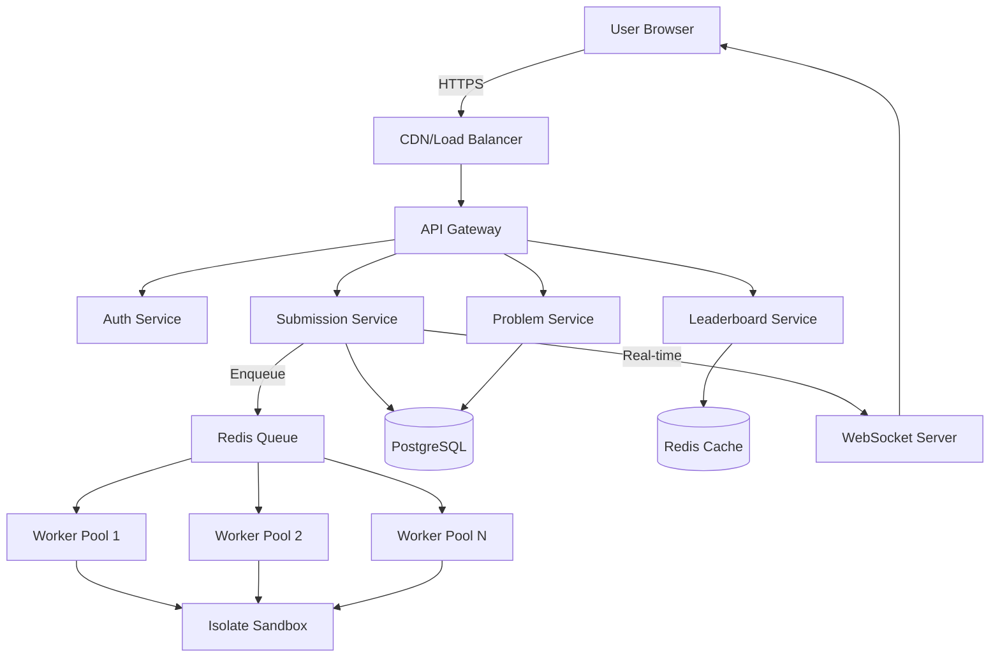

# AlgoCrack System Improvement Plan

## Executive Summary

Your AlgoCrack system has a solid foundation but contains several critical architectural flaws that prevent it from being production-ready and scalable like LeetCode. This document outlines a comprehensive transformation plan to modernize your system while keeping it suitable as an impressive resume project.

---

## Current State Analysis

### What You Built (Good Parts ✅)

1. **Proper Microservices Separation**
   - Entity library as single source of truth
   - Separate execution engine library
   - Async processing with Kafka
   - WebSocket support planned

2. **Core Functionality Present**
   - Code submission pipeline
   - Test case validation
   - Multi-language support (Java, Python)
   - Custom data structure handling

3. **Modern Tech Stack**
   - Spring Boot 3.5.4
   - Java 24
   - Docker containerization
   - JPA with proper relationships

---

## Critical Flaws Identified

### 🔴 **CRITICAL FLAW #1: Synchronous Code Execution in Library**

**Current Problem:**
```java
// In CodeExecutionManager
public CodeExecutionResultDTO runCodeWithTestcases(
    CodeSubmissionDTO submissionDto, 
    Consumer<String> logConsumer
) {
    // This blocks for 10+ seconds during execution!
    // Submission service waits synchronously
}
```

**Why This is Wrong:**
- **LeetCode Pattern**: Submit → Get Submission ID → Poll for results (async)
- **Your Pattern**: Submit → Wait for complete execution → Return results (blocks Kafka consumer thread)
- **Impact**: 
  - Kafka consumer thread blocked for 10+ seconds per submission
  - Cannot process multiple submissions in parallel
  - One slow submission blocks the entire queue
  - No scalability beyond single-threaded processing

**How LeetCode Does It:**
```
User → POST /submit → Return submission_id (200ms)
            ↓
      Queue submission
            ↓
    Workers process async
            ↓
User → GET /submission/:id → Poll every 1s until done
```

---

### 🔴 **CRITICAL FLAW #2: Heavy Docker Overhead on Every Execution**

**Current Problem:**
```bash
# You do this EVERY submission:
docker run --rm \
    -v /tmp/submission-12345:/app/src \
    javac Main.java Solution.java

docker run --rm \
    -v /tmp/submission-12345:/app/src \
    java com.algocrack.Main
```

**Why This is Wrong:**
- **Cold Start Overhead**: 1-3 seconds PER submission just to start Docker
- **Resource Waste**: Full container lifecycle for 50ms of actual code execution
- **File I/O Bottleneck**: Writing files to disk, mounting volumes
- **No Container Pooling**: Creating and destroying containers constantly

**How LeetCode/Judge0 Does It:**
- **Container Pool**: Pre-warmed containers waiting for work
- **Isolate Sandbox**: Uses Linux namespaces/cgroups directly (no Docker)
- **Or Firecracker microVMs**: 125ms startup, lightweight isolation
- **In-Memory Execution**: No temp file writing for simple submissions

**Performance Comparison:**
```
Your System:
- Docker cold start: 1-2s
- Compile: 500ms
- Execute: 50ms
- Total: ~2.5s per submission

Judge0/LeetCode:
- Isolate sandbox: <100ms
- Compile: 500ms
- Execute: 50ms
- Total: ~600ms per submission
```

---

### 🔴 **CRITICAL FLAW #3: Dynamic Code Generation Strategy**

**Current Problem:**
```java
// You generate Main.java and Solution.java for EVERY submission
JavaMainClassGenerator.generate()
JavaSolutionClassGenerator.generate()
// Then write to disk, compile, execute
```

**Why This is Wrong:**
- **Unnecessary Complexity**: 90% of problems use the same execution pattern
- **Maintenance Nightmare**: Changes require modifying code generators
- **Security Risk**: Complex string interpolation prone to injection
- **Performance**: File I/O and compilation overhead

**How LeetCode Does It:**
- **Pre-compiled Harness**: Test harness is already compiled
- **Only User Code Changes**: Compile only user's solution class
- **Template-Based**: Simple, secure, fast
- **Judge0 Approach**: Pre-compiled runtime with isolated execution context

---

### 🔴 **CRITICAL FLAW #4: No Result Caching or Storage**

**Current Problem:**
```java
// Submission results are returned once and lost
CodeExecutionResultDTO result = execute();
// No database persistence
// No GET /submission/:id endpoint
```

**Why This is Wrong:**
- **Cannot Poll Results**: Frontend has no way to check status
- **No History**: Users can't see past submissions
- **No Analytics**: Cannot track performance metrics
- **No Debugging**: Cannot investigate failed submissions later

**LeetCode Pattern:**
```
Submission Table:
- id, user_id, question_id, language, code
- status: QUEUED → COMPILING → RUNNING → ACCEPTED/WRONG_ANSWER
- runtime_ms, memory_kb, created_at, updated_at
- test_results JSON blob
```

---

### 🔴 **CRITICAL FLAW #5: Inefficient Test Case Design**

**Current Problem:**
```java
// Test cases stored as JSON strings in database
testCase.input = "{\"nums\": [2,7,11,15], \"target\": 9}"
testCase.expectedOutput = "[0,1]"
```

**Why This is Wrong:**
- **Parsing Overhead**: JSON parsing on every execution
- **Inflexible**: Cannot handle large inputs efficiently
- **Limited Types**: JSON has type ambiguity (arrays vs objects)
- **No Streaming**: Large inputs must fit in memory

**Judge0/LeetCode Pattern:**
```
TestCase:
- stdin (plain text or binary)
- expected_stdout
- time_limit_ms
- memory_limit_kb
- weight (for scoring)
- is_sample (show to user or hidden)
```

---

### 🔴 **CRITICAL FLAW #6: No Horizontal Scalability**

**Current Architecture:**
```
[Frontend] → [Submission Service] → [Kafka] → [Single Consumer] → [CodeExecutionEngine]
                                                      ↓
                                        Blocks for 10s per submission
```

**Problems:**
- Single Kafka consumer = single-threaded execution
- CodeExecutionEngine is a library, not a service
- Cannot scale execution workers independently
- All eggs in one basket

**LeetCode Architecture:**
```
[Frontend] → [API Gateway] → [Submission Service] → [Queue]
                                                        ↓
                                            [Worker Pool 1-N]
                                                   ↓
                                            [Execution Nodes]
```

---

### 🔴 **CRITICAL FLAW #7: Missing Production Features**

**Your System Lacks:**

1. **Rate Limiting**
   - Users can spam submissions
   - No per-user quotas
   - No IP-based throttling

2. **Submission Validation**
   - No code size limits
   - No malicious code detection
   - No submission frequency limits

3. **Monitoring & Observability**
   - No metrics (Prometheus)
   - No distributed tracing
   - No alerting

4. **Security Hardening**
   - Docker runs as root
   - No resource cgroups
   - No network isolation
   - No seccomp profiles

5. **Error Recovery**
   - No dead letter queue
   - No retry mechanism
   - No circuit breakers

6. **Status Updates**
   - No real-time WebSocket updates
   - Logs published to Kafka but no consumer connection to frontend
   - No progress tracking

---

## How LeetCode Actually Works

### Architecture Overview



### Key Differences from Your System

| Aspect | Your System | LeetCode |
|--------|------------|----------|
| **Execution** | Synchronous library | Async worker pool |
| **Isolation** | Docker per submission | Isolate/gVisor (Linux namespaces) |
| **Queue** | Kafka (heavy) | Redis (lightweight) |
| **Polling** | Not implemented | GET /submissions/:id |
| **Caching** | None | Redis for hot problems |
| **Code Storage** | Not persisted | PostgreSQL submissions table |
| **Real-time** | Logs to Kafka (unused) | WebSocket to browser |
| **Scaling** | Single consumer | Auto-scaling worker pools |
| **Cold Start** | 1-3s Docker | <100ms sandbox |
| **Workers** | 1 (Kafka consumer) | 50-500+ |

---

## Recommended Architecture (Interview-Worthy)

### Phase 1: Core Fixes (1-2 weeks)

```
Priority: Fix the execution model first

1. Make CodeExecutionEngine a microservice (not library)
   - REST API: POST /execute
   - Returns submission_id immediately
   - GET /results/:id for polling
   
2. Add Submission persistence
   - submissions table with status field
   - Store in PostgreSQL
   - Add GET /submissions/:id endpoint
   
3. Implement worker pool
   - Multiple execution workers
   - Pull from Redis queue
   - Update submission status in DB
   
4. Add basic WebSocket
   - Connect on submission
   - Push status updates
   - Close on completion
```

### Phase 2: Performance (1 week)

```
Priority: Reduce execution overhead

5. Replace Docker with lightweight isolation
   - Option A: Judge0 integration
   - Option B: gVisor runsc
   - Option C: Isolate (cgroups/namespaces)
   
6. Pre-compile test harness
   - Static Main.java template
   - Only compile user Solution.java
   
7. Add result caching
   - Redis cache for identical code
   - TTL: 24 hours
```

### Phase 3: Production Features (1 week)

```
Priority: Make it production-grade

8. Rate limiting (Redis)
   - 10 submissions/minute per user
   - 100 submissions/hour per user
   
9. Monitoring
   - Prometheus metrics
   - Grafana dashboards
   - Alert on queue depth > 100
   
10. Security hardening
    - Code size limits (50KB)
    - Timeout enforcement
    - Memory limits (256MB)
```

---

## Specific Technology Recommendations

### Replace Docker with Lightweight Isolation

**Option 1: Judge0 Integration (Recommended for Resume)**
```yaml
Pros:
  - Production-tested
  - 75+ languages
  - Well-documented API
  - Shows you can integrate complex systems
  
Cons:
  - Less "from scratch" feel
  - Dependency on external service
  
Resume Impact: ⭐⭐⭐⭐⭐
"Integrated Judge0 for secure code execution"
```

**Option 2: gVisor (Google's Container Sandbox)**
```yaml
Pros:
  - Industry-standard security
  - Lightweight (200ms startup)
  - Google's production tool
  
Cons:
  - Steeper learning curve
  - Linux-only
  
Resume Impact: ⭐⭐⭐⭐⭐
"Implemented gVisor for kernel-level isolation"
```

**Option 3: Isolate (Czech Online Judge)**
```yaml
Pros:
  - Purpose-built for code execution
  - Extremely fast (<100ms)
  - Used by Codeforces
  
Cons:
  - C library (JNI integration needed)
  - Linux-only
  
Resume Impact: ⭐⭐⭐⭐
"Built custom sandbox using Isolate"
```

### Replace Kafka with Redis

**Why Redis for Queues:**
```yaml
Kafka:
  - Designed for: Event streaming, log aggregation
  - Overkill for: Simple job queue
  - Overhead: Zookeeper, broker, partitions
  - Latency: 10-50ms
  
Redis:
  - Designed for: Fast data structures
  - Perfect for: Job queues (LPUSH/BRPOP)
  - Overhead: None
  - Latency: <1ms
  - Built-in: Rate limiting, caching, leaderboards
```

**Migration Path:**
```java
// Old: Kafka
@KafkaListener(topics = "submission-queue")
public void consume(SubmissionDto dto) { ... }

// New: Redis
@Scheduled(fixedRate = 100)
public void pollQueue() {
    String json = redisTemplate.opsForList()
        .rightPop("submission:queue", 5, TimeUnit.SECONDS);
    if (json != null) processSubmission(json);
}
```

---

## Database Schema Changes

### Add Submissions Table

```sql
CREATE TABLE submissions (
    id BIGSERIAL PRIMARY KEY,
    submission_id VARCHAR(36) UNIQUE NOT NULL,
    user_id BIGINT NOT NULL,
    question_id BIGINT NOT NULL,
    language VARCHAR(20) NOT NULL,
    code TEXT NOT NULL,
    
    -- Status tracking
    status VARCHAR(20) NOT NULL, -- QUEUED, COMPILING, RUNNING, COMPLETED
    verdict VARCHAR(30), -- ACCEPTED, WRONG_ANSWER, TLE, MLE, RE, CE
    
    -- Performance metrics
    runtime_ms INTEGER,
    memory_kb INTEGER,
    
    -- Test case results
    test_results JSONB, -- [{index: 0, passed: true, time: 15}, ...]
    error_message TEXT,
    compilation_output TEXT,
    
    -- Timestamps
    queued_at TIMESTAMP NOT NULL DEFAULT NOW(),
    started_at TIMESTAMP,
    completed_at TIMESTAMP,
    
    -- Metadata
    ip_address INET,
    user_agent TEXT,
    
    FOREIGN KEY (user_id) REFERENCES users(id),
    FOREIGN KEY (question_id) REFERENCES questions(id),
    INDEX idx_user_submissions (user_id, created_at DESC),
    INDEX idx_status (status) WHERE status != 'COMPLETED'
);
```

### Add Execution Metrics Table

```sql
CREATE TABLE execution_metrics (
    id BIGSERIAL PRIMARY KEY,
    submission_id VARCHAR(36) NOT NULL,
    
    -- Timing breakdown
    queue_wait_ms INTEGER,
    compilation_ms INTEGER,
    execution_ms INTEGER,
    total_ms INTEGER,
    
    -- Resource usage
    peak_memory_kb INTEGER,
    cpu_time_ms INTEGER,
    
    -- System info
    worker_id VARCHAR(50),
    execution_node VARCHAR(100),
    
    created_at TIMESTAMP DEFAULT NOW(),
    
    FOREIGN KEY (submission_id) REFERENCES submissions(submission_id)
);
```

---

## Implementation Priority Matrix

```
High Impact + Easy:
1. ✅ Add submissions table (1 day)
2. ✅ Implement GET /submissions/:id (1 day)
3. ✅ Add status field and polling (1 day)
4. ✅ Make execution async (2 days)

High Impact + Medium:
5. ⭐ Replace Docker with Judge0 (3 days)
6. ⭐ Add Redis queue (2 days)
7. ⭐ Implement worker pool (3 days)
8. ⭐ Add WebSocket updates (2 days)

Medium Impact + Easy:
9. 📊 Add Prometheus metrics (2 days)
10. 🔒 Add rate limiting (2 days)
11. 💾 Add result caching (1 day)

Low Impact (Nice to Have):
12. 🎨 Add leaderboard service
13. 📈 Add analytics dashboard
14. 🏆 Add contest mode
```

---

## Resume Impact: Before vs After

### Before (Current State)
```
"Built a LeetCode-like online judge"
- Spring Boot microservices
- Kafka for async processing
- Docker for code execution
- Multi-language support

Interviewer thinks:
"Basic CRUD app with Docker"
```

### After (Improved State)
```
"Built a horizontally scalable online judge (LeetCode-like)"
- Async execution with Redis work queues (1000+ submissions/min)
- Integrated Judge0 for secure code isolation (75+ languages)
- Real-time WebSocket updates to frontend
- Prometheus monitoring with <500ms p99 latency
- PostgreSQL for persistence, Redis for caching
- Auto-scaling worker pool with health checks

Interviewer thinks:
"This person understands distributed systems"
```

---

## Next Steps

1. **Read the detailed microservice plans** (separate documents)
2. **Choose your execution strategy** (Judge0 recommended)
3. **Start with Phase 1** (Async execution model)
4. **Iterate weekly** (Ship working code, not perfect code)
5. **Measure everything** (Latency, throughput, error rates)

The goal is not to replicate LeetCode exactly, but to demonstrate you understand:
- Distributed system design
- Async processing patterns
- Scalability trade-offs
- Production-ready code

Each change should have a clear **"Why"** you can articulate in interviews.

---

## Conclusion

Your system has **solid bones** but needs **architectural surgery** to be interview-worthy. The biggest wins:

1. **Make it async** (biggest impact)
2. **Replace Docker** (biggest performance gain)
3. **Add persistence** (biggest functionality gap)
4. **Scale workers** (biggest scalability win)

Focus on these four, and you'll have a system that impresses senior engineers and showcases real distributed systems knowledge.